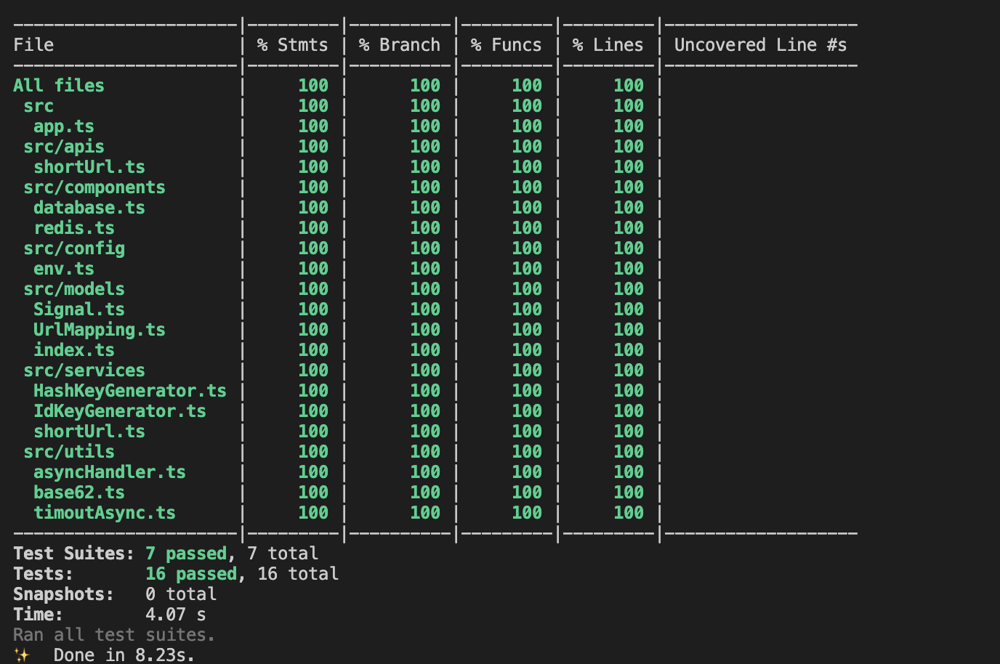

## 短域名服务实现设计

### 设计思路

短码生成方式有自增 id，摘要算法。此工程使用自增 id 的生成方式。

1. 定义发号器
   采用 mongodb 做发号器，保证每个请求的序号连续唯一。

   为了降低发号器的压力，采用发号器加本地子序列一起来生成序号，序号 = 发号器序号\*子序列长度 + 当前子序列号。如从发号器获取到值后，本地先递增本地子序列，当超过子序列长度后，再次获取新的发号器序号。nodejs 虽然是单进程，也要控制并发请求发号器。

2. 加入缓存

   适当的使用缓存可以提升系统的吞吐量，在系统中，分别使用了一个读缓存和一个写缓存
   。
   请求获取短链接的接口，对于热点数据将大大提升性能

   生成短链接的接口，短期内请求两条一样的链接地址，不需要查库就可以直接返回

#### 生成短域名流程图

[在线文档地址](https://www.processon.com/view/link/61b225167d9c0829fee9c903)

### 获取源地址流程图

[在线文档地址](https://www.processon.com/view/link/61b220a61e08534ca6dde814)

### 单元测试覆盖率

[详细信息](../coverage/lcov-report/index.html)

